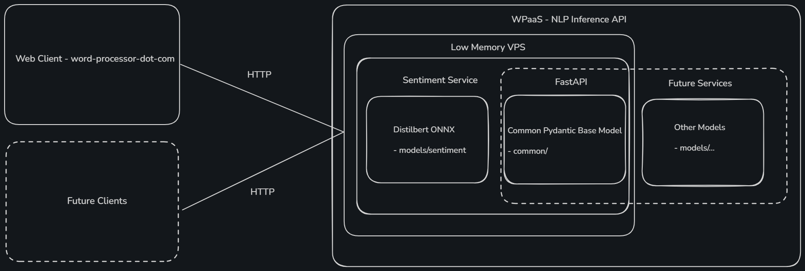

# Word processing-as-a-service - NLP Inference API

A lightweight, production‑style REST API built with FastAPI for serving natural langauge processing (NLP) models for tasks such as sentiment analysis. The system and models are designed for deployment on constrained environments such as a VPS with 1 GiB of memory. Emphasis of this project is placed on modularity, ease of deployment, and utilizing scalable patterns.

This project generalizes my earlier Canucks sentiment analysis work @ [github.com/ericcheung1/canucks-sentiment](https://github.com/ericcheung1/canucks-sentiment), turning from a single Flask app with hardcoded logic into a scalable, multi‑model inference service.


## Architectural Diagram



Each model/endpoint is isolated to build as its own container image, sharing a common Pydantic schema for consistent input validation. This structure hopes to enable easier deployment, easier extension to new NLP tasks, and minimal resource usage. Model weights are also included and stored with Git LFS to keep dependicies minimal.

## Example Request

### Sentiment

- POST /sentiment

```
Request: # Can also be sent without text_id field

{
  "texts": [
    {
      "text": "I love eating nachos!",
      "text_id": "abc123"
    },
    {
      "text": "I hate eating nachos!",
      "text_id": "def345"
    }
  ]
}

Response: 

{
  "sentiment": [
    {
      "sentiment_classification": "POSITIVE",
      "sentiment_confidence": [
        0.0003287792205810547,
        0.99951171875
      ],
      "text_id": "abc123"
    },
    {
      "sentiment_classification": "NEGATIVE",
      "sentiment_confidence": [
        0.9765625,
        0.023345947265625
      ],
      "text_id": "def345"
    }
  ]
}
```
 Note: first index of the `sentiment_confidence` array is confidence of the text having negative sentiment and second index is confidence of text having positive sentiment

## Run Locally

This repository uses Git LFS to store model weights.
Make sure Git LFS is installed with `git lfs install` before cloning.

#### With Source
Clone the repo, from the project root, install dependencies with `pip install -r models/<NLP-task>/requirements.txt`, activate venv, then start server with `uvicorn models.<NLP-task>.main:app --host 0.0.0.0 --port 8000`.

#### With Docker
Pull the latest build with `docker pull ghcr.io/ericcheung1/wpaas-<NLP-task>:main`, then start container with `docker run -p 8000:8000 ghcr.io/ericcheung1/wpaas-<NLP-task>:main`.

## Model(s)

### Sentiment

- Fine-tuned DistilBERT model for sentiment classification
- Model weights are included in the repository using Git LFS
- Weights have been converted to .onnx format and FP16 precision 
- Runs in ONNX runtime for improved loading and inference speeds

## Client(s)

This API is currently used by the following client service(s):

- Web app: [word-processor-dot-com](https://github.com/ericcheung1/word-processor-dot-com)